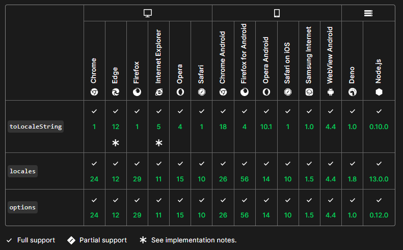

# Currency Format Node.js
To understand how currency is formatted in Node .js

>10     => 10.00
100    => 100.00
1000   => 1,000.00
10000  => 10,000.00
100000 => 100,000.00

##Locales 
#####toLocaleString(locales)
>"en-US", // United States
  "de-DE", // Germany
  "ru-RU", // Russia
  "hi-IN", // India
  "de-CH", // Switzerland
  "ar-EG", // Arabic

##Using Options
######toLocaleString(locales, options)

>// request a currency format
console.log(number.toLocaleString('de-DE', { style: 'currency', currency: 'EUR' }));
// → 123.456,79 €`

>// the Japanese yen doesn't use a minor unit
console.log(number.toLocaleString('ja-JP', { style: 'currency', currency: 'JPY' }))
// → ￥123,457`

>// limit to three significant digits
console.log(number.toLocaleString('en-IN', { maximumSignificantDigits: 3 }));
// → 1,23,000`

>// Use the host default language with options for number formatting
const num = 30000.65;
console.log(num.toLocaleString(undefined, {minimumFractionDigits: 2, maximumFractionDigits: 2}));
// → "30,000.65" where English is the default language, or
// → "30.000,65" where German is the default language, or
// → "30 000,65" where French is the default language

###Browser Compatibility
